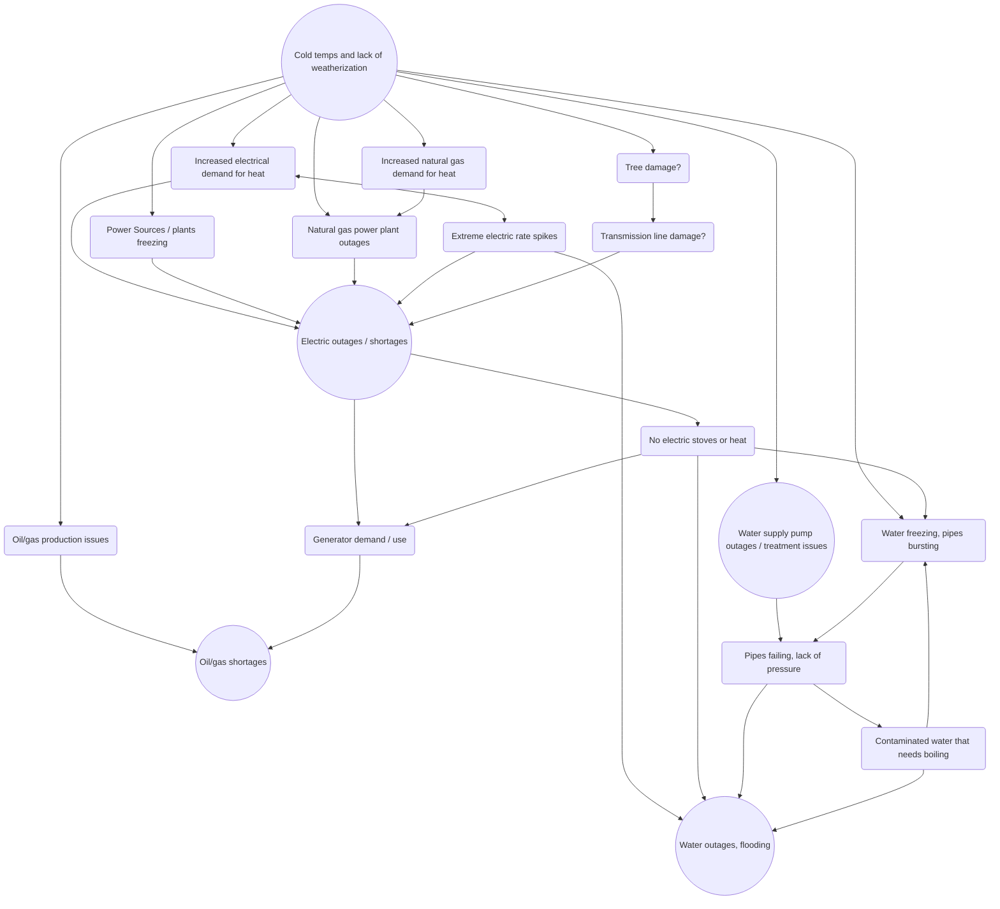

Visualizing Salesforce data can be tricky.

Let's try building a gantt chart here

```mermaid
    graph TD
    A --> C(Power Sources / plants freezing)
    A --> D(Tree damage?)
    A --> E(Increased natural gas demand for heat)
    A --> F(Natural gas power plant outages)
    A --> G(Oil/gas production issues)
    A --> H((Water supply pump outages / treatment issues))
    A --> I(Water freezing, pipes bursting)
    A((Cold temps and lack of weatherization)) --> B(Increased electrical demand for heat)
    B --> K((Electric outages / shortages))
    B <--> J(Extreme electric rate spikes)
    C --> K
    D --> L(Transmission line damage?)
    E --> F
    F --> K
    G --> M((Oil/gas shortages))
    H --> Q(Pipes failing, lack of pressure)
    I --> Q
    J --> K
    J --> P
    K --> N(Generator demand / use)
    K --> O(No electric stoves or heat)
    L --> K
    N --> M
    O --> I
    O --> N
    O --> P((Water outages, flooding))
    Q --> P
    Q --> R(Contaminated water that needs boiling)
    R --> I
    R --> P
```